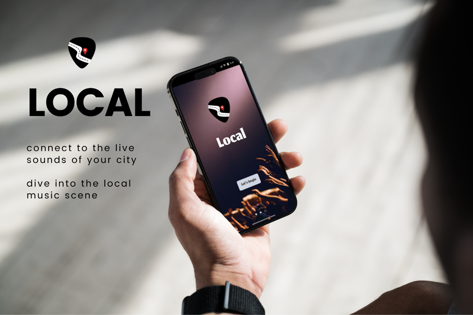
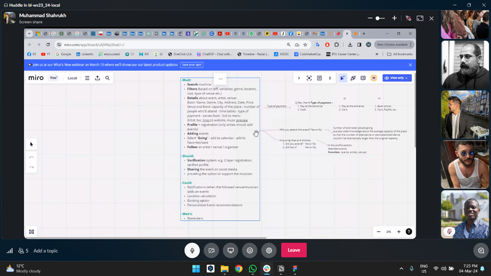
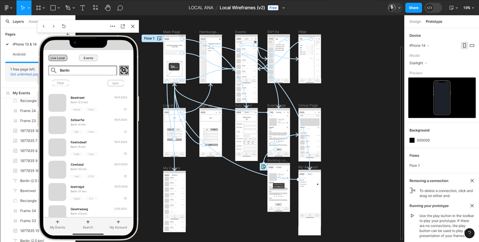
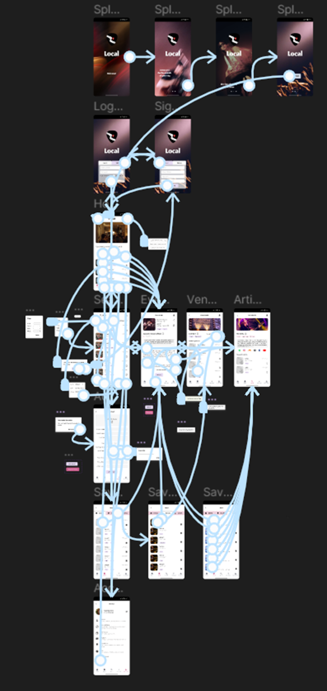

"LOCAL" is an app designed to spotlight small music events and performances by local, independent musicians across the city. The app can be used by music enjoyers to find events, or to add events if they own a venue or are artists themselves. The app delivers curated results and recommendations, based on the selected city.

## UX Track

The process of kick-starting the project, particularly for the UX team started out smoothly. There was some initial work being done before getting to the teamwork stage, so fortunately, we had some preliminary preparation. Also, we had primary and useful discussions together with the whole team about what the app could and would be, so that we were mostly set about what would be the overall direction of the project, what we think about it, and getting a sense of our individual contribution to it.
 Moreover, our mentor, Vincent, provided clear structure and valuable feedback along the way, which greatly facilitated our workflow within the designated time frame.
 Our work (Reza and Ana) started with user research; we built a Research Survey, gathered and analysed data from the user answers, and created Personas. Then we communicated the results with the team. As we had their support, it enabled us to discuss and define the necessary features and requirements for the app together.

|  |  |
| - | - | 

 
 We continued our track with undertaking different UX tasks such as creating Storyboards, User Flows, Information Architecture schemes, Low and High Fidelity Wireframes (which were progressing from the start and till the end of our project), and then eventually, we reached the stages of Prototyping and conducted User Testing.

 We maintained close communication within the UX track throughout the project, making joint decisions and consulting regularly to ensure alignment. We also held several meetings, sometimes including Vincent, to clarify our goals and tasks. One notable pressure point was the dependency of the entire team on the UX output. While scheduling conflicts and agreeing on details sometimes posed challenges, these issues were manageable and did not significantly affect our progress.

## WD Track

I admit, starting out alone was a bit nerve-wracking. Without a partner to bounce ideas off of or troubleshoot with, the workload seemed a tad overwhelming. To get going, I started piecing together something based on the project presentation wireframes. It was a clever workaround, saving me from waiting on the actual wireframes. But, as with most things, there were pros and cons. On the upside, having certain components prepped, like the search bar and event cards, was a boon. However, once I needed to split them up, everything seemed to unravel. It wasn't as simple as dividing the code into two files as I'd anticipated. In fact, it took considerable effort to reassemble them. What's more, a file that initially served as a renderer morphed into a multipurpose file over time, leading to a frustrating circularity I couldn't untangle on my own. Thankfully, a friend lent a hand with that conundrum.

Throughout the coding process, certain themes and patterns emerged. Initially, progress was a bit stuttering, and the longer I stared at the code, and the longer one sat at it sometimes the more the problems! Thankfully a night of sleep will refresh thy mind (import refresh from 'react-native/mind-refresher/sleep). Finding solutions to unfamiliar problems and debugging became integral parts of the journey. The sheer number of times I was confronted with error-messages and that was spent on trying to fix  things (and trying to fix the fixes, with incompatibilities, deprecations and so on) forced me to hone a new skill: articulating my issues effectively in search queries to unearth relevant solutions.

In hindsight, I learned that coding demands meticulous planning, logical structuring, and breaking tasks down into manageable chunks. It's a lesson I'll carry forward. If you think you've planned enough, plan some more. And if it feels like overkill, well, plan a bit more anyway. Besides that, working with Can on the backend and having to find solutions to get front end and back end to work has been a pleasant journey.

## DS Track

### Can

### Shahrukh

So I started out as a DS techie for the team LOCAL to provide the backend support for the Data of the concerts happening in the local scene. The first and foremost task was to find relevant datasets that are compatible with our problem statement and this took us to deep dive on Kaggle (recommended by our mentor) to look for a solution. After shortlisting 3 to 4 datasets, the team decided to go with the ‘music schedule’ which was close to fulfilling the needs as it had some ideal characteristics for our project. 
From here on, the main DS work began from cleaning the dataset to modifying it as per our use. Since the app required filtering-based search as an MVP, I prepared the dataset for searching to ensure that the search does not break down. Additionally, I performed data analytics to create filters that display relevant results for the search items in the user interface.

## Readme
Once the data set was finalized. It was up to the DS techies to clean the dataset and make amendments in the dataset that makes it usable for the project.  Initially, the raw data consisted of the shape (1901, 11) with 1901 rows and 11 columns. As some of the columns did not make any sense for the project such as the ‘audio’ links of the artists, ‘title_and_location’ column was a merger of the ‘venue’ and ‘artist’ column therefore they were dropped to make to reduce the number of columns and the complexity in the dataset. Moreover, the ‘home’ column was separated into different columns namely ‘city’ and the ‘state’ to simplify the search centred around location as well as to create city based filters for the users. Apart from these, many ‘NaN’ value based rows were removed from the dataset as these were causing a hindrance for the search tool. 
So after data cleaning and modification the data was ready to be created for filtration. The modified data had a shape of (1068, 9) with 1068 rows and 9 rows. Genre filters were created to show the users specifically those concerts based on their taste of music they usually listen to such as Electronic, Pop, Hip-Hop etc. Users may filter out results based on the city that they live in to find out the local music scene happening in their city or might want to visit nearby cities to attend any concert of their favourite artist. And finally, the ticket price filter serves as the combination of price brackets that the user may want see, which helps them to reach a decision of whether to buy a concert ticket or not. 
Additionally, since we wanted to add a feature of filtering based on the tickets entry price of the concerts, hence random integer values were created for the concerts and assigned to the individuals rows so that price based filters could be created and the user may use them to base on their willingness to pay.  An added bonus feature initially thought of was to add ratings to the concerts based on the users past experiences as well as to provide recommendations, therefore these had also been added to the dataset. 
However, in order to graduate integrating a Machine Learning algorithm was a need and this motivated us to look for ways to implement it into our project. The team came across the decision to create a recommendation system based on the data set to the users where they may see similar concerts apart from their search. To get started with ML algos, our track lead suggested to either go for collaborative filtering based or content based recommendation system, which led us to research deeper into backend working of a recommendation system and coming up with a content based recommendation ML algo that fits the bill according to our dataset. For deploying our content based recommendation system we first had to extract the relevant features from the dataset that could be used for the analysis such as the genre, artist, venue etc. Then we used the Scikit TF-IDF (Term Frequency-Inverse Document Frequency) vectorization to convert our features into number and the amount of times these occur in our dataset. The cosine similarity function calculates this similarity scores among the concerts and gives an output of the concerts that are similar in nature (features) such is an example of concerts that are taking place on the same venue with comparable genre, city etc. and finally generate recommendations based on the similarity scores.

